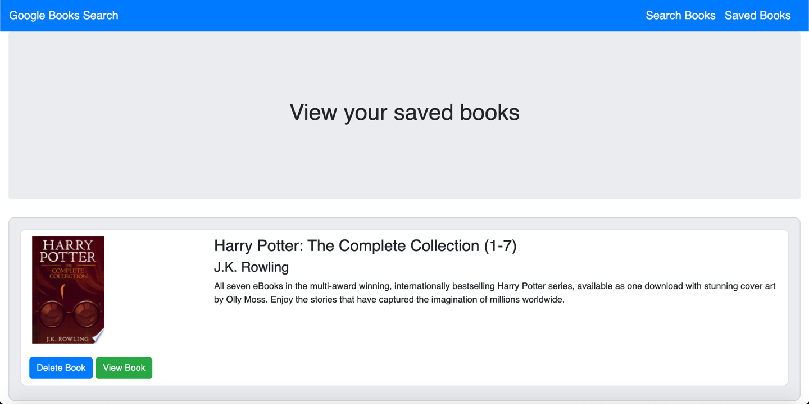

       

<h1 align="center">Welcome to my Google Books Search Application 👋</h1>

## Description

📚 This is a `React-based Google Books Search` app. It is built on `React components`, works with `util functions`, and utilizes `React lifecycle methods` to query and display books based on user searches. It also uses `Node, Express and MongoDB` so that users can save books to review or purchase later.

## Table of Contents 🗂

* [Description](#Description)
* [Installation](#Installation)
* [Usage](#Usage)
* [License](#License)
* [Version](#Version)
* [Contributing](#Contributing)
* [Tests](#Tests)
* [Questions](#Questions)

## Installation

⚙️ use `Clone with HTTPS` and run `git clone + the HTTPS link` to install locally. Run `npm i`.

## Usage

🚨 run `npm run start` to run the app locally

View live demo <a href="https://googlebooks-reactsearch.herokuapp.com">here</a>

## License

🖋 

This app is using an MIT license

## Version

℣ 

## Contributing

👩‍💻 Please feel free to create a fork and submit a PR for review

## Tests

🧪 n/a

## Questions

❓ Feel free to create an issue for review

🌍 https://github.com/darren-behan

📧 me at darrenbehan@hotmail.com
